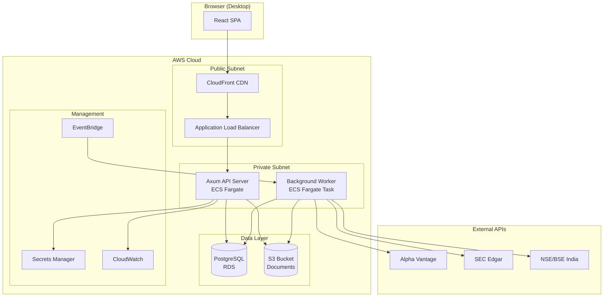
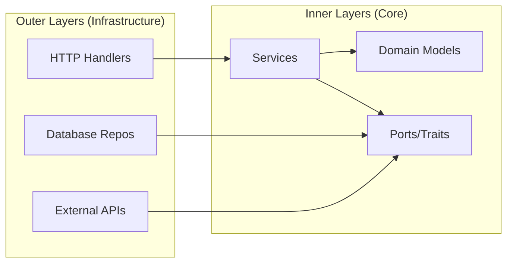
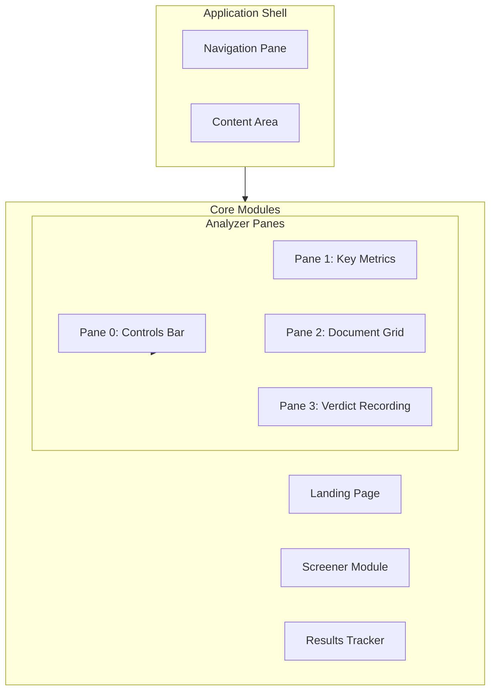
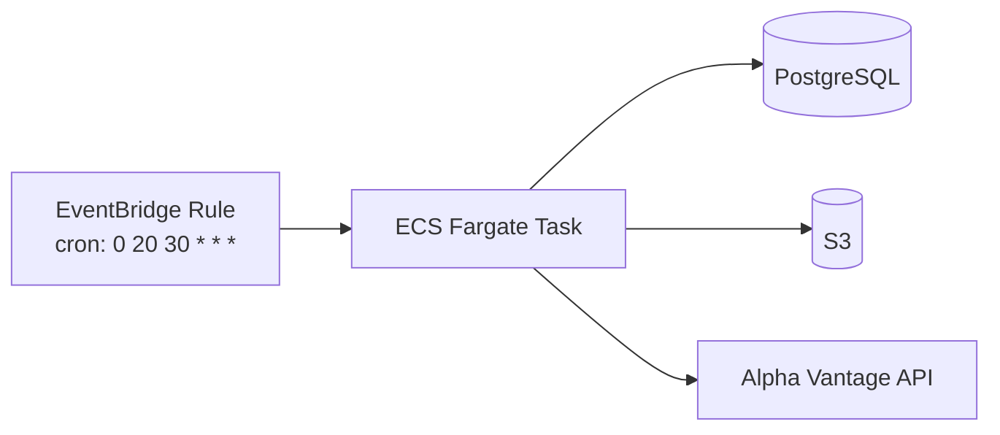
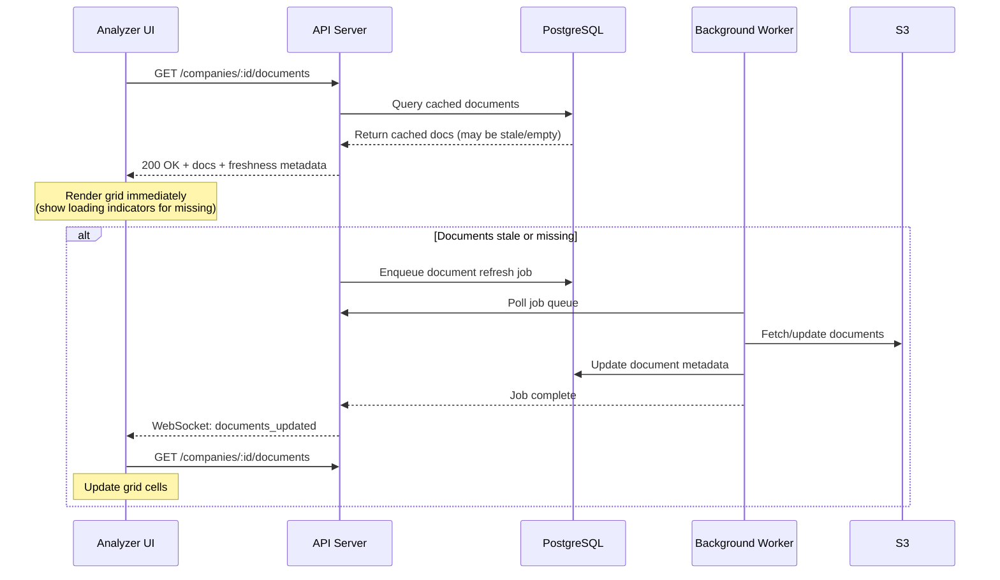

# Investment Analysis Platform (iap-alpha) - Architecture Design Document

**Version**: 3.0  
**Date**: January 17, 2026  
**Status**: Draft for Review  
**Repository**: [`iap-alpha`](https://github.com/TrantorVector/iap-alpha.git) (Investment Analysis Platform - Alpha)  
**Related Documents**: [PRD v1.4](./prd-v1-4.md) | [Database Design v1](./database-design-v1.md) | [Build Plan v3](./build-plan-v3/00-table-of-contents.md)

> [!NOTE]
> **This document (v3) supersedes architecture-design-v2.md**. Key changes: updated IaC to Pulumi TypeScript, aligned repository naming to `iap-alpha`.

---

## Changelog from v1.0

> [!IMPORTANT]
> **v2.0 addresses all high-impact gaps identified in the architecture critique:**

| Change | Section | Impact |
|--------|---------|--------|
| Added **Optimistic Locking Contract** | §6.4 | Prevents lost updates in multi-tab Analyzer |
| Defined **Async Document Retrieval** | §9.4 | Non-blocking Analyzer open, background fetch |
| Added **Period Window Generator** | §4.5 | Consistent period modeling for Pane 1 & 2 |
| Fixed **Analysis Report → Verdict History** linkage | §6.5 | Proper audit trail for uploaded reports |
| Added **User Preferences** schema | §4.6, §6.6 | Persists document row ordering per user |
| Standardized **Argon2id** (clarified) | §7.3 | Consistent security spec |
| Promoted **Rate-Limit Mitigation** to MVP | §18.4 | Provider tiering from day 1 |
| Deferred **RLS** explicitly | §15.3 | Safer MVP, explicit WHERE clauses |
| **IaC: Pulumi TypeScript deviation** | §8.1 | Pragmatic MVP choice, better LLM support |

---

## Table of Contents

1. [Executive Summary](#1-executive-summary)
2. [Technology Stack](#2-technology-stack)
3. [System Architecture](#3-system-architecture)
4. [Backend Architecture](#4-backend-architecture)
5. [Frontend Architecture](#5-frontend-architecture)
6. [API Design](#6-api-design)
7. [Authentication & Security](#7-authentication--security)
8. [Infrastructure & Deployment](#8-infrastructure--deployment)
9. [Background Jobs & Scheduling](#9-background-jobs--scheduling)
10. [Observability & Monitoring](#10-observability--monitoring)
11. [CI/CD Pipeline](#11-cicd-pipeline)
12. [Testing Strategy](#12-testing-strategy)
13. [Acceptance Automation](#13-acceptance-automation)
14. [Extensibility Patterns](#14-extensibility-patterns)
15. [Global Expansion Readiness](#15-global-expansion-readiness)
16. [Audit & Compliance](#16-audit--compliance)
17. [Development Workflow](#17-development-workflow)
18. [External API Integration](#18-external-api-integration)
19. [Cost Estimates](#19-cost-estimates)
20. [Risk Assessment](#20-risk-assessment)

---

## 1. Executive Summary

This document defines the technical architecture for the Investment Research Platform, a cloud-hosted web application for systematic equity analysis across US and Indian markets.

### Key Architecture Decisions

| Category | Decision | Rationale |
|----------|----------|-----------|
| **Backend** | Rust + Axum + Tokio | Type safety, performance, compile-time SQL verification |
| **Frontend** | React + TypeScript + Shadcn/UI + Tailwind | Rich ecosystem, type safety, modern component library |
| **API** | REST + OpenAPI | Simplicity, caching, tooling |
| **Database** | PostgreSQL (AWS RDS) | JSONB support, full-text search, window functions |
| **Container** | AWS ECS Fargate | Serverless containers, no cluster management |
| **IaC** | Pulumi TypeScript | MVP: better maturity/LLM support (see §8.1 deviation note) |
| **Background Jobs** | AWS EventBridge + ECS Fargate | Managed scheduling, 30+ minute job support |
| **Auth** | RS256 JWT | Asymmetric signing, microservices-ready |
| **Observability** | CloudWatch + X-Ray | AWS-native, sufficient for MVP |
| **CI/CD** | GitHub Actions | Native GitHub integration, Rust caching |

### Development Philosophy

> [!IMPORTANT]
> This platform is **100% AI-built** (Antigravity/Claude Code/OpenAI Codex) with no human code authorship. Architecture must support:
> - **Automated validation** replacing human code review
> - **Comprehensive test pyramid** catching regressions before deployment
> - **Enterprise-grade extensibility** for $100B+ scale future growth

---

## 2. Technology Stack

### 2.1 Backend Stack

| Component | Technology | Version | Purpose |
|-----------|------------|---------|---------|
| Language | **Rust** | 1.75+ | Type-safe, high-performance backend |
| Framework | **Axum** | 0.7+ | Async HTTP framework built on tokio |
| Runtime | **Tokio** | 1.0+ | Async runtime with work-stealing scheduler |
| Database | **SQLx** | 0.7+ | Compile-time verified SQL queries |
| Serialization | **Serde** | 1.0+ | JSON serialization/deserialization |
| HTTP Client | **Reqwest** | 0.11+ | Async HTTP client for external APIs |
| Validation | **Validator** | 0.16+ | Request validation |
| Logging | **Tracing** | 0.1+ | Structured logging with JSON formatting |
| Auth | **jsonwebtoken** | 9.0+ | JWT token handling |
| Password | **argon2** | 0.5+ | Password hashing (Argon2id) |

### 2.2 Frontend Stack

| Component | Technology | Version | Purpose |
|-----------|------------|---------|---------|
| Framework | **React** | 18+ | Component-based UI |
| Language | **TypeScript** | 5.0+ | Type-safe JavaScript |
| Build Tool | **Vite** | 5.0+ | Fast builds, HMR |
| UI Components | **Shadcn/UI** | Latest | Copy-paste components, full control |
| Styling | **Tailwind CSS** | 3.4+ | Utility-first CSS |
| Data Tables | **TanStack Table** | 8.0+ | Headless table with sorting/filtering |
| Charts | **Recharts** | 2.0+ | Financial metrics visualization |
| State | **TanStack Query** | 5.0+ | Server state management |
| Forms | **React Hook Form** | 7.0+ | Performant form handling |
| Routing | **React Router** | 6.0+ | Client-side routing |

### 2.3 Infrastructure Stack

| Component | Technology | Purpose |
|-----------|------------|---------|
| Cloud | **AWS** | Primary cloud provider |
| Containers | **ECS Fargate** | Serverless container orchestration |
| Database | **RDS PostgreSQL** | Managed PostgreSQL 15+ |
| Object Storage | **S3** | Document storage |
| CDN | **CloudFront** | Static asset delivery |
| Secrets | **Secrets Manager** | API keys, DB credentials, JWT keys |
| IaC | **Pulumi TypeScript** | IaC (MVP deviation: see §8.1 note) |
| Scheduling | **EventBridge** | Cron-based job triggers |

---

## 3. System Architecture

### 3.1 High-Level Architecture



### 3.2 Component Responsibilities

| Component | Responsibilities |
|-----------|------------------|
| **React SPA** | UI rendering, user interactions, client-side state |
| **CloudFront** | CDN for static assets, SSL termination |
| **ALB** | Load balancing, health checks, HTTPS termination |
| **Axum API** | Business logic, JWT auth, database access |
| **Background Worker** | Nightly polling, document retrieval, metrics calculation |
| **PostgreSQL** | Persistent storage for all structured data |
| **S3** | Document storage (PDFs, presentations, transcripts) |
| **Secrets Manager** | Secure storage for credentials and API keys |
| **EventBridge** | Cron scheduling for background jobs |
| **CloudWatch** | Logging, metrics, alerting |

---

## 4. Backend Architecture

### 4.1 Project Structure

```
backend/
├── Cargo.toml              # Workspace manifest
├── api/                    # HTTP API binary
│   ├── Cargo.toml
│   └── src/
│       ├── main.rs
│       ├── config.rs       # Configuration management
│       ├── routes/         # HTTP handlers
│       │   ├── mod.rs
│       │   ├── auth.rs
│       │   ├── companies.rs
│       │   ├── screeners.rs
│       │   ├── analyzer.rs
│       │   └── tracker.rs
│       ├── middleware/     # Auth, logging, rate limiting
│       └── error.rs        # Error handling
├── core/                   # Business logic library
│   ├── Cargo.toml
│   └── src/
│       ├── lib.rs
│       ├── domain/         # Domain models
│       ├── services/       # Business logic
│       ├── ports/          # Trait definitions (interfaces)
│       ├── periods/        # Period window generator (NEW)
│       └── metrics/        # Metric calculations
├── db/                     # Database layer
│   ├── Cargo.toml
│   └── src/
│       ├── lib.rs
│       ├── repositories/   # Data access layer
│       ├── models/         # Database models
│       └── migrations/     # SQLx migrations
├── worker/                 # Background job binary
│   ├── Cargo.toml
│   └── src/
│       ├── main.rs
│       ├── jobs/           # Job implementations
│       └── scheduler.rs
└── providers/              # External API integrations
    ├── Cargo.toml
    └── src/
        ├── lib.rs
        ├── alpha_vantage/
        ├── sec_edgar/
        ├── nse_bse/
        └── mock/           # Mock implementations for testing
```

### 4.2 Clean Architecture Layers



**Key Principles**:
- **Dependency Rule**: Dependencies point inward only
- **Ports & Adapters**: Core defines traits; infrastructure implements them
- **Testability**: Core logic testable without database or HTTP

### 4.3 Core Service Example

```rust
// core/src/ports/market_data.rs
#[async_trait]
pub trait MarketDataProvider: Send + Sync {
    async fn get_income_statement(&self, symbol: &str) -> Result<IncomeStatement>;
    async fn get_daily_prices(&self, symbol: &str) -> Result<Vec<DailyPrice>>;
    async fn get_company_overview(&self, symbol: &str) -> Result<CompanyOverview>;
}

// providers/src/alpha_vantage/mod.rs
pub struct AlphaVantageProvider {
    client: HttpClient,
    rate_limiter: RateLimiter,
    config: AlphaVantageConfig,
}

impl MarketDataProvider for AlphaVantageProvider {
    async fn get_income_statement(&self, symbol: &str) -> Result<IncomeStatement> {
        self.rate_limiter.acquire().await?;
        // Implementation...
    }
}

// providers/src/mock/mod.rs
pub struct MockProvider {
    responses: HashMap<String, serde_json::Value>,
}

impl MarketDataProvider for MockProvider {
    // Mock implementation for testing
}
```

### 4.4 Error Handling

```rust
// core/src/error.rs
use thiserror::Error;

#[derive(Error, Debug)]
pub enum AppError {
    #[error("Authentication failed: {0}")]
    AuthError(String),
    
    #[error("Resource not found: {resource} with id {id}")]
    NotFound { resource: &'static str, id: String },
    
    #[error("Database error: {0}")]
    DatabaseError(#[from] sqlx::Error),
    
    #[error("External API error: {provider} - {message}")]
    ExternalApiError { provider: String, message: String },
    
    #[error("Validation error: {0}")]
    ValidationError(String),
    
    #[error("Rate limit exceeded")]
    RateLimitExceeded,
    
    #[error("Conflict: resource modified by another request")]
    OptimisticLockConflict {
        resource: &'static str,
        id: String,
        current_version: i32,
    },
}

impl IntoResponse for AppError {
    fn into_response(self) -> Response {
        let (status, code, body) = match &self {
            AppError::AuthError(_) => (StatusCode::UNAUTHORIZED, "AUTH_ERROR", json!({"message": self.to_string()})),
            AppError::NotFound { .. } => (StatusCode::NOT_FOUND, "NOT_FOUND", json!({"message": self.to_string()})),
            AppError::ValidationError(_) => (StatusCode::BAD_REQUEST, "VALIDATION_ERROR", json!({"message": self.to_string()})),
            AppError::RateLimitExceeded => (StatusCode::TOO_MANY_REQUESTS, "RATE_LIMITED", json!({"message": self.to_string()})),
            AppError::OptimisticLockConflict { current_version, .. } => (
                StatusCode::CONFLICT, 
                "CONFLICT", 
                json!({"message": self.to_string(), "current_version": current_version})
            ),
            _ => (StatusCode::INTERNAL_SERVER_ERROR, "INTERNAL_ERROR", json!({"message": "Internal server error"})),
        };
        
        Json(json!({ "error": { "code": code, "details": body } })).into_response()
    }
}
```

### 4.5 Period Window Generator (NEW)

> [!IMPORTANT]
> **Addresses critique #3**: First-class period modeling for Pane 1 metrics and Pane 2 document grid alignment.

```rust
// core/src/periods/mod.rs

/// Represents a fiscal period with consistent labeling
#[derive(Debug, Clone, PartialEq, Eq)]
pub struct FiscalPeriod {
    pub period_end_date: NaiveDate,
    pub period_type: PeriodType,
    pub fiscal_year: i32,
    pub fiscal_quarter: Option<i32>,  // None for annual
    pub display_label: String,        // e.g., "FY2024", "Q3 2024"
}

#[derive(Debug, Clone, PartialEq, Eq)]
pub enum PeriodType {
    Annual,
    Quarterly,
}

/// Generates consistent period windows for both metrics and documents
pub struct PeriodWindowGenerator {
    fiscal_year_end_month: u32,  // e.g., 3 for March, 12 for December
}

impl PeriodWindowGenerator {
    pub fn new(fiscal_year_end_month: u32) -> Self {
        Self { fiscal_year_end_month }
    }

    /// Generate periods for display (4-10 periods based on user selection)
    pub fn generate_periods(
        &self,
        period_count: usize,  // 4-10
        period_type: PeriodType,
        as_of_date: NaiveDate,
    ) -> Vec<FiscalPeriod> {
        let mut periods = Vec::with_capacity(period_count);
        
        for i in 0..period_count {
            let period = match period_type {
                PeriodType::Annual => self.calculate_annual_period(as_of_date, i),
                PeriodType::Quarterly => self.calculate_quarterly_period(as_of_date, i),
            };
            periods.push(period);
        }
        
        periods
    }

    /// Label format: "FY2024" for annual, "Q3 2024" for quarterly
    /// Note: No "Q4" notation when quarter aligns with fiscal year end
    fn format_label(&self, period: &FiscalPeriod) -> String {
        match period.period_type {
            PeriodType::Annual => format!("FY{}", period.fiscal_year),
            PeriodType::Quarterly => {
                let q = period.fiscal_quarter.unwrap_or(4);
                // If Q4 aligns with fiscal year end, show as "FY" instead
                if q == 4 && self.is_fy_aligned(&period.period_end_date) {
                    format!("FY{}", period.fiscal_year)
                } else {
                    format!("Q{} {}", q, period.fiscal_year)
                }
            }
        }
    }
}
```

### 4.6 User Preferences Model (NEW)

> [!IMPORTANT]
> **Addresses critique #5**: Persists document row ordering and other per-user settings.

```rust
// core/src/domain/user_preferences.rs

#[derive(Debug, Clone, Serialize, Deserialize)]
pub struct UserPreferences {
    pub user_id: Uuid,
    pub document_row_order: Vec<DocumentType>,  // Ordered list
    pub default_period_count: i32,              // 4-10
    pub default_period_type: PeriodType,        // Annual/Quarterly
    pub theme: Theme,
    pub updated_at: DateTime<Utc>,
}

#[derive(Debug, Clone, Serialize, Deserialize)]
#[serde(rename_all = "snake_case")]
pub enum DocumentType {
    EarningsCallTranscript,
    AnnualReport,
    QuarterlyReport,
    InvestorPresentation,
    AnalystReport,
}

impl Default for UserPreferences {
    fn default() -> Self {
        Self {
            user_id: Uuid::nil(),
            document_row_order: vec![
                DocumentType::EarningsCallTranscript,
                DocumentType::QuarterlyReport,
                DocumentType::AnnualReport,
                DocumentType::InvestorPresentation,
            ],
            default_period_count: 8,
            default_period_type: PeriodType::Quarterly,
            theme: Theme::System,
            updated_at: Utc::now(),
        }
    }
}
```

---

## 5. Frontend Architecture

### 5.1 Project Structure

```
frontend/
├── package.json
├── vite.config.ts
├── tsconfig.json
├── tailwind.config.js
├── src/
│   ├── main.tsx
│   ├── App.tsx
│   ├── api/                  # Generated API client
│   │   ├── client.ts
│   │   └── types.ts
│   ├── components/
│   │   ├── ui/               # Shadcn/UI components
│   │   ├── layout/           # Layout components
│   │   ├── screener/         # Screener module components
│   │   ├── analyzer/         # Analyzer module components
│   │   └── tracker/          # Results tracker components
│   ├── hooks/                # Custom React hooks
│   ├── pages/                # Page components
│   ├── stores/               # Client state (zustand or context)
│   ├── lib/                  # Utilities
│   └── types/                # TypeScript types
└── public/
```

### 5.2 Module Layout



### 5.3 Data Fetching Pattern

```typescript
// hooks/useCompanyMetrics.ts
import { useQuery } from '@tanstack/react-query';
import { api } from '@/api/client';

export function useCompanyMetrics(companyId: string, options: MetricsOptions) {
  return useQuery({
    queryKey: ['company-metrics', companyId, options],
    queryFn: () => api.companies.getMetrics(companyId, options),
    staleTime: 5 * 60 * 1000, // 5 minutes
    gcTime: 30 * 60 * 1000,   // 30 minutes
    retry: (failureCount, error) => {
      if (error.status === 404) return false;
      return failureCount < 3;
    },
  });
}
```

---

## 6. API Design

### 6.1 API Versioning

**Strategy**: URL path versioning (`/api/v1/...`)

```
Base URL: https://api.invest.example.com/api/v1
```

### 6.2 Core Endpoints

#### Authentication

| Method | Endpoint | Description |
|--------|----------|-------------|
| POST | `/auth/login` | Authenticate user, return tokens |
| POST | `/auth/refresh` | Refresh access token |
| POST | `/auth/logout` | Revoke refresh token |

#### Companies

| Method | Endpoint | Description |
|--------|----------|-------------|
| GET | `/companies` | List companies with filters |
| GET | `/companies/:id` | Get company details |
| GET | `/companies/:id/metrics` | Get computed metrics |
| GET | `/companies/:id/documents` | List available documents |
| GET | `/companies/:id/documents/:docId/download` | Get download URL |
| POST | `/companies/:id/documents` | Upload document |

#### Screeners

| Method | Endpoint | Description |
|--------|----------|-------------|
| GET | `/screeners` | List user's screeners |
| POST | `/screeners` | Create screener |
| GET | `/screeners/:id` | Get screener details |
| PUT | `/screeners/:id` | Update screener |
| DELETE | `/screeners/:id` | Delete screener |
| POST | `/screeners/:id/run` | Execute screener |

#### Verdicts

| Method | Endpoint | Description |
|--------|----------|-------------|
| GET | `/companies/:id/verdict` | Get current verdict |
| PUT | `/companies/:id/verdict` | Create/update verdict (with lock_version) |
| GET | `/companies/:id/verdict/history` | Get verdict history |

#### User Preferences (NEW)

| Method | Endpoint | Description |
|--------|----------|-------------|
| GET | `/users/me/preferences` | Get user preferences |
| PUT | `/users/me/preferences` | Update user preferences |

### 6.3 OpenAPI Specification

Backend generates `openapi.json` from route definitions using `utoipa`:

```rust
use utoipa::OpenApi;

#[derive(OpenApi)]
#[openapi(
    paths(
        auth::login,
        companies::list,
        companies::get_metrics,
        screeners::create,
        screeners::run,
        verdicts::update,
        preferences::get,
        preferences::update,
    ),
    components(schemas(Company, Metrics, Screener, Verdict, UserPreferences))
)]
pub struct ApiDoc;
```

### 6.4 Optimistic Locking Contract (NEW)

> [!IMPORTANT]
> **Addresses critique #1**: End-to-end contract for multi-tab Analyzer edits.

#### Client Request (PUT /companies/:id/verdict)

```json
{
  "lock_version": 3,
  "final_verdict": "INVEST",
  "summary_text": "Strong revenue growth, reasonable valuation",
  "strengths": ["Revenue CAGR 25%", "Market leader"],
  "weaknesses": ["High debt ratio"],
  "linked_report_ids": ["uuid-1", "uuid-2"]
}
```

#### Server Behavior

```rust
// db/src/repositories/verdicts.rs

pub async fn update_verdict(
    pool: &PgPool,
    verdict_id: Uuid,
    update: VerdictUpdate,
) -> Result<Verdict, AppError> {
    // Atomic check-and-update with version increment
    let result = sqlx::query_as!(
        Verdict,
        r#"
        UPDATE verdicts 
        SET 
            final_verdict = $1,
            summary_text = $2,
            strengths = $3,
            weaknesses = $4,
            lock_version = lock_version + 1,
            updated_at = NOW()
        WHERE verdict_id = $5 AND lock_version = $6
        RETURNING *
        "#,
        update.final_verdict,
        update.summary_text,
        &update.strengths,
        &update.weaknesses,
        verdict_id,
        update.lock_version,
    )
    .fetch_optional(pool)
    .await?;

    match result {
        Some(verdict) => Ok(verdict),
        None => {
            // Fetch current version for conflict response
            let current = get_verdict(pool, verdict_id).await?;
            Err(AppError::OptimisticLockConflict {
                resource: "verdict",
                id: verdict_id.to_string(),
                current_version: current.lock_version,
            })
        }
    }
}
```

#### Conflict Response (409)

```json
{
  "error": {
    "code": "CONFLICT",
    "details": {
      "message": "Conflict: resource modified by another request",
      "current_version": 4,
      "current_state": {
        "verdict_id": "uuid",
        "lock_version": 4,
        "final_verdict": "PASS",
        "summary_text": "...",
        "updated_at": "2026-01-16T15:30:00Z"
      }
    }
  }
}
```

#### Frontend Handling

```typescript
// hooks/useVerdictMutation.ts
export function useVerdictMutation(companyId: string) {
  const queryClient = useQueryClient();
  
  return useMutation({
    mutationFn: (update: VerdictUpdate) => api.verdicts.update(companyId, update),
    onError: (error) => {
      if (error.status === 409) {
        const conflict = error.body.error.details;
        // Show merge dialog with current_state
        showConflictDialog({
          yourVersion: update,
          serverVersion: conflict.current_state,
          onResolve: (merged) => {
            // Retry with new lock_version
            mutate({ ...merged, lock_version: conflict.current_version });
          },
        });
      }
    },
    onSuccess: () => {
      queryClient.invalidateQueries(['verdict', companyId]);
    },
  });
}
```

### 6.5 Analysis Report to Verdict History Linkage (NEW)

> [!IMPORTANT]
> **Addresses critique #4**: Proper audit trail for uploaded analysis reports.

#### Database Schema Update

```sql
-- Link analysis reports to specific verdict history versions
ALTER TABLE analysis_reports 
ADD COLUMN verdict_history_id UUID REFERENCES verdict_history(history_id);

-- Index for fast lookups
CREATE INDEX idx_analysis_reports_history ON analysis_reports(verdict_history_id);
```

#### Upload Flow

```rust
// When uploading analysis report, create history snapshot first
pub async fn upload_analysis_report(
    pool: &PgPool,
    s3: &S3Client,
    verdict_id: Uuid,
    file: UploadedFile,
) -> Result<AnalysisReport> {
    let mut tx = pool.begin().await?;
    
    // 1. Create verdict history snapshot (captures current state)
    let history = sqlx::query_as!(
        VerdictHistory,
        r#"
        INSERT INTO verdict_history (verdict_id, version, final_verdict, summary_text, recorded_at)
        SELECT verdict_id, lock_version, final_verdict, summary_text, NOW()
        FROM verdicts WHERE verdict_id = $1
        RETURNING *
        "#,
        verdict_id
    )
    .fetch_one(&mut *tx)
    .await?;
    
    // 2. Upload to S3
    let s3_key = format!("reports/{}/{}", verdict_id, file.filename);
    s3.put_object(&s3_key, file.bytes).await?;
    
    // 3. Create report record linked to history
    let report = sqlx::query_as!(
        AnalysisReport,
        r#"
        INSERT INTO analysis_reports (verdict_id, verdict_history_id, storage_key, filename)
        VALUES ($1, $2, $3, $4)
        RETURNING *
        "#,
        verdict_id,
        history.history_id,
        s3_key,
        file.filename
    )
    .fetch_one(&mut *tx)
    .await?;
    
    tx.commit().await?;
    Ok(report)
}
```

### 6.6 User Preferences Endpoints (NEW)

```rust
// api/src/routes/preferences.rs

#[utoipa::path(get, path = "/api/v1/users/me/preferences")]
async fn get_preferences(
    State(state): State<AppState>,
    Extension(claims): Extension<Claims>,
) -> Result<Json<UserPreferences>, AppError> {
    let prefs = state.db.get_user_preferences(claims.sub).await?
        .unwrap_or_else(|| UserPreferences::default_for(claims.sub));
    Ok(Json(prefs))
}

#[utoipa::path(put, path = "/api/v1/users/me/preferences")]
async fn update_preferences(
    State(state): State<AppState>,
    Extension(claims): Extension<Claims>,
    Json(update): Json<UserPreferencesUpdate>,
) -> Result<Json<UserPreferences>, AppError> {
    let prefs = state.db.upsert_user_preferences(claims.sub, update).await?;
    Ok(Json(prefs))
}
```

---

## 7. Authentication & Security

### 7.1 JWT Configuration

| Parameter | Value | Notes |
|-----------|-------|-------|
| Algorithm | RS256 | Asymmetric (RSA) |
| Access Token TTL | 24 hours | Short-lived |
| Refresh Token TTL | 30 days | Stored in database |
| Signing Key | RSA 2048-bit | Stored in Secrets Manager |

### 7.2 Token Structure

```json
{
  "header": {
    "alg": "RS256",
    "typ": "JWT"
  },
  "payload": {
    "sub": "user_uuid",
    "iat": 1705420800,
    "exp": 1705507200,
    "iss": "iap-api",
    "scope": ["read", "write"]
  }
}
```

### 7.3 Security Controls

> [!NOTE]
> **Addresses critique #6**: Argon2id is the definitive choice. PRD and DB comments should be updated to match.

| Control | Implementation |
|---------|----------------|
| **Password Hashing** | **Argon2id** (memory=65536 KiB, iterations=3, parallelism=4) |
| Rate Limiting | 5 login attempts per 15 minutes per IP |
| HTTPS | TLS 1.3 enforced via ALB |
| CORS | Whitelist production/staging origins |
| SQL Injection | Parameterized queries via SQLx |
| Input Validation | Request validation on all endpoints |
| Secrets | All secrets in AWS Secrets Manager |
| DB Access | Private subnet, security group restricted |

### 7.4 Authentication Middleware

```rust
use axum::middleware;

async fn auth_middleware(
    State(state): State<AppState>,
    TypedHeader(auth): TypedHeader<Authorization<Bearer>>,
    mut request: Request,
    next: Next,
) -> Result<Response, AppError> {
    let token = auth.token();
    let claims = state.jwt_validator.validate(token)
        .map_err(|_| AppError::AuthError("Invalid token".into()))?;
    
    request.extensions_mut().insert(claims);
    Ok(next.run(request).await)
}

// Apply to protected routes
let protected = Router::new()
    .route("/screeners", get(list_screeners).post(create_screener))
    .layer(middleware::from_fn_with_state(state.clone(), auth_middleware));
```

---

## 8. Infrastructure & Deployment

### 8.1 Pulumi Infrastructure

> [!IMPORTANT]
> **Approved MVP Deviation: Pulumi TypeScript**
>
> While a "full Rust stack" was the aspirational choice, the MVP uses **Pulumi TypeScript** because:
> - Pulumi TypeScript SDK is more mature with better AWS provider coverage
> - Superior documentation and examples for LLM-assisted development (Antigravity/Claude)
> - Empirically better success rate with AI coding tools
>
> This deviation is implemented in [build-plan-v3/13-cloud-deployment.md](./build-plan-v3/13-cloud-deployment.md).
>
> **Post-MVP consideration**: Re-evaluate Pulumi Rust SDK when it reaches stable maturity.

```typescript
// infra/index.ts (TypeScript implementation)
import * as pulumi from "@pulumi/pulumi";
import * as aws from "@pulumi/aws";
import * as awsx from "@pulumi/awsx";

const config = new pulumi.Config();
const environment = pulumi.getStack();

// VPC with public and private subnets
const vpc = new awsx.ec2.Vpc("iap-vpc", {
    cidrBlock: "10.0.0.0/16",
    numberOfAvailabilityZones: 2,
    subnetSpec: [
        { type: "Public", cidrMask: 24 },
        { type: "Private", cidrMask: 24 },
    ],
    natGateways: { strategy: "Single" },
    tags: { Environment: environment },
});

// ECS Cluster
const cluster = new aws.ecs.Cluster("iap-cluster", {
    settings: [{ name: "containerInsights", value: "enabled" }],
});

// RDS PostgreSQL (see 13-cloud-deployment.md for full config)
export const vpcId = vpc.vpcId;
export const clusterArn = cluster.arn;
```

### 8.2 Environment Strategy

| Environment | Database | Infrastructure | Purpose |
|-------------|----------|----------------|---------|
| **dev** | Docker PostgreSQL | docker-compose | Local development |
| **staging** | RDS (db.t3.micro) | Full AWS stack | Integration testing |
| **prod** | RDS (db.t3.medium) | Full AWS stack | Production |

---

## 9. Background Jobs & Scheduling

### 9.1 Job Architecture



### 9.2 Nightly Job Schedule

| Job | Time (IST) | Time (UTC) | Frequency |
|-----|------------|------------|-----------|
| Earnings Calendar Poll | 2:00 AM | 20:30 (prev day) | Daily |
| Price Refresh | 2:15 AM | 20:45 (prev day) | Daily |
| FX Rate Refresh | 2:30 AM | 21:00 (prev day) | Daily |
| Document Refresh | 3:00 AM | 21:30 (prev day) | Daily |
| Metrics Recalculation | 4:00 AM | 22:30 (prev day) | Daily |

### 9.3 Job Implementation

```rust
// worker/src/jobs/earnings_poll.rs
pub struct EarningsPollingJob {
    db: PgPool,
    provider: Arc<dyn MarketDataProvider>,
}

impl EarningsPollingJob {
    pub async fn run(&self) -> Result<JobResult> {
        let job_id = self.create_job_record("earnings_calendar_poll").await?;
        
        let active_companies = self.db.get_active_tracked_companies().await?;
        let mut processed = 0;
        let mut updated = 0;

        for company in active_companies {
            match self.poll_company(&company).await {
                Ok(did_update) => {
                    processed += 1;
                    if did_update { updated += 1; }
                }
                Err(e) => {
                    tracing::warn!(company_id = %company.id, error = %e, "Poll failed");
                }
            }
        }

        self.complete_job_record(job_id, processed, updated).await?;
        Ok(JobResult { processed, updated })
    }
}
```

### 9.4 Async Document Retrieval Policy (NEW)

> [!IMPORTANT]
> **Addresses critique #2**: Analyzer-open is non-blocking. Documents fetch asynchronously.



#### Implementation

```rust
// api/src/routes/documents.rs

#[derive(Serialize)]
pub struct DocumentsResponse {
    documents: Vec<Document>,
    freshness: FreshnessMetadata,
}

#[derive(Serialize)]
pub struct FreshnessMetadata {
    last_refreshed_at: Option<DateTime<Utc>>,
    is_stale: bool,
    refresh_requested: bool,
}

async fn get_company_documents(
    State(state): State<AppState>,
    Path(company_id): Path<Uuid>,
) -> Result<Json<DocumentsResponse>, AppError> {
    // 1. Get cached documents immediately
    let docs = state.db.get_cached_documents(company_id).await?;
    let last_refresh = state.db.get_last_refresh(company_id, "documents").await?;
    
    let is_stale = last_refresh
        .map(|t| Utc::now() - t > Duration::hours(24))
        .unwrap_or(true);
    
    // 2. If stale, enqueue background refresh (non-blocking)
    let refresh_requested = if is_stale {
        state.job_queue.enqueue(RefreshDocumentsJob { company_id }).await.is_ok()
    } else {
        false
    };
    
    // 3. Return immediately with freshness metadata
    Ok(Json(DocumentsResponse {
        documents: docs,
        freshness: FreshnessMetadata {
            last_refreshed_at: last_refresh,
            is_stale,
            refresh_requested,
        },
    }))
}
```

#### Frontend Handling

```typescript
// hooks/useCompanyDocuments.ts
export function useCompanyDocuments(companyId: string) {
  const queryClient = useQueryClient();
  
  const query = useQuery({
    queryKey: ['documents', companyId],
    queryFn: () => api.companies.getDocuments(companyId),
  });
  
  // Subscribe to WebSocket for real-time updates
  useEffect(() => {
    const ws = createWebSocket();
    ws.on('documents_updated', (data) => {
      if (data.company_id === companyId) {
        queryClient.invalidateQueries(['documents', companyId]);
      }
    });
    return () => ws.close();
  }, [companyId]);
  
  return {
    ...query,
    isStale: query.data?.freshness.is_stale,
    isRefreshing: query.data?.freshness.refresh_requested,
  };
}
```

---

## 10. Observability & Monitoring

### 10.1 Logging Strategy

**Format**: Structured JSON via `tracing` crate

```rust
use tracing::{info, instrument};

#[instrument(skip(db), fields(company_id = %company_id))]
async fn get_company_metrics(
    db: &PgPool,
    company_id: Uuid,
) -> Result<Metrics> {
    info!("Fetching metrics");
    // ...
}
```

### 10.2 Alert Configuration

| Alert | Condition | Severity |
|-------|-----------|----------|
| API Error Rate | > 5% for 5 minutes | Critical |
| API Latency P95 | > 3 seconds | Warning |
| Database Connections | > 80% pool utilized | Warning |
| Nightly Job Failure | Any failure | Critical |
| RDS Storage | > 80% used | Warning |
| RDS CPU | > 80% for 10 minutes | Warning |

---

## 11-17. [Unchanged from v1]

> Sections 11-17 remain unchanged from v1. See [architecture-design-v1.md](./architecture-design-v1.md) for:
> - CI/CD Pipeline
> - Testing Strategy
> - Acceptance Automation
> - Extensibility Patterns
> - Global Expansion Readiness
> - Audit & Compliance
> - Development Workflow

---

## 15.3 Multi-Tenant Approach (UPDATED)

> [!WARNING]
> **Addresses critique #8**: RLS deferred to Phase 2. MVP uses explicit WHERE clauses.

### MVP Approach (Phase 1)

```rust
// Explicit user_id filtering in all queries
pub async fn get_user_screeners(pool: &PgPool, user_id: Uuid) -> Result<Vec<Screener>> {
    sqlx::query_as!(
        Screener,
        "SELECT * FROM screeners WHERE user_id = $1 ORDER BY updated_at DESC",
        user_id
    )
    .fetch_all(pool)
    .await
    .map_err(Into::into)
}
```

### Phase 2 Approach (If Needed)

If RLS is implemented in Phase 2, follow safe connection pooling pattern:

```rust
// Set user context per transaction, reset on return to pool
async fn with_user_context<T, F, Fut>(
    pool: &PgPool,
    user_id: Uuid,
    operation: F,
) -> Result<T>
where
    F: FnOnce(PoolConnection<Postgres>) -> Fut,
    Fut: Future<Output = Result<T>>,
{
    let mut conn = pool.acquire().await?;
    
    // Set user context for RLS
    sqlx::query("SELECT set_config('app.current_user_id', $1, true)")
        .bind(user_id.to_string())
        .execute(&mut *conn)
        .await?;
    
    let result = operation(conn).await;
    
    // Note: connection is returned to pool automatically
    // set_config with 'true' makes it transaction-local, so it resets
    result
}
```

---

## 18. External API Integration

### 18.1 Alpha Vantage Configuration

```toml
# config/alpha_vantage.toml
[rate_limits]
# Free tier limits (update when upgrading)
calls_per_minute = 5
calls_per_day = 25

[retry]
max_attempts = 3
base_delay_ms = 1000
max_delay_ms = 30000
backoff_multiplier = 2.0

[endpoints]
base_url = "https://www.alphavantage.co/query"
```

### 18.4 Provider Tiering & MVP Rate-Limit Strategy (NEW)

> [!IMPORTANT]
> **Addresses critique #7**: Rate-limit mitigation promoted to MVP requirement.

```rust
// providers/src/tiered_provider.rs

pub struct TieredMarketDataProvider {
    primary: Arc<dyn MarketDataProvider>,      // Alpha Vantage
    fallbacks: Vec<Arc<dyn MarketDataProvider>>, // Yahoo, FMP, etc.
    cache: Arc<ResponseCache>,
    budget: Arc<ApiBudgetManager>,
}

impl TieredMarketDataProvider {
    pub async fn get_income_statement(&self, symbol: &str) -> Result<IncomeStatement> {
        // 1. Check cache first (aggressive caching)
        if let Some(cached) = self.cache.get("income_statement", symbol).await? {
            if !cached.is_stale() {
                return Ok(cached.data);
            }
        }
        
        // 2. Check budget before API call
        if !self.budget.can_spend("income_statement").await {
            // Return stale cache if available
            if let Some(cached) = self.cache.get("income_statement", symbol).await? {
                tracing::warn!(symbol, "Returning stale data due to budget exhaustion");
                return Ok(cached.data);
            }
            return Err(AppError::RateLimitExceeded);
        }
        
        // 3. Try primary provider
        match self.primary.get_income_statement(symbol).await {
            Ok(data) => {
                self.cache.set("income_statement", symbol, &data).await?;
                self.budget.record_spend("income_statement").await;
                Ok(data)
            }
            Err(e) => {
                // 4. Try fallbacks
                for fallback in &self.fallbacks {
                    if let Ok(data) = fallback.get_income_statement(symbol).await {
                        self.cache.set("income_statement", symbol, &data).await?;
                        return Ok(data);
                    }
                }
                Err(e)
            }
        }
    }
}

/// Per-endpoint daily budgets
pub struct ApiBudgetManager {
    budgets: HashMap<String, AtomicU32>,
    daily_limits: HashMap<String, u32>,
}

impl ApiBudgetManager {
    pub fn new() -> Self {
        let mut limits = HashMap::new();
        // Allocate 25 daily calls across endpoints
        limits.insert("income_statement".into(), 5);
        limits.insert("balance_sheet".into(), 5);
        limits.insert("cash_flow".into(), 5);
        limits.insert("daily_prices".into(), 5);
        limits.insert("company_overview".into(), 5);
        
        Self {
            budgets: limits.keys().map(|k| (k.clone(), AtomicU32::new(0))).collect(),
            daily_limits: limits,
        }
    }
}
```

---

## 19. Cost Estimates

### 19.1 Monthly AWS Costs (MVP)

| Service | Specification | Monthly Cost |
|---------|---------------|--------------|
| **ECS Fargate (API)** | 0.5 vCPU, 1GB RAM, 24/7 | ~$15 |
| **ECS Fargate (Worker)** | 0.5 vCPU, 1GB RAM, 1hr/day | ~$1 |
| **RDS PostgreSQL** | db.t3.medium, 100GB | ~$50 |
| **S3** | 250GB Standard-IA | ~$3 |
| **CloudFront** | 50GB transfer | ~$5 |
| **Secrets Manager** | 5 secrets | ~$2 |
| **CloudWatch** | Logs + Metrics | ~$5 |
| **Data Transfer** | 10GB/month | ~$1 |
| **Total Infrastructure** | | **~$82/month** |

---

## 20. Risk Assessment

### 20.1 Technical Risks

| Risk | Likelihood | Impact | Mitigation |
|------|------------|--------|------------|
| Alpha Vantage rate limits | High | Medium | **Provider tiering (MVP)**, caching, fallbacks |
| API response format changes | Medium | High | Schema validation, alerting on parse failures |
| Database performance at scale | Low | High | Indexing strategy, partitioning, read replicas |
| Security vulnerabilities | Medium | Critical | Automated security scanning, regular audits |
| AI-generated code bugs | Medium | Medium | Comprehensive test coverage (80%+) |
| Optimistic lock conflicts | Medium | Low | **Conflict resolution UI (MVP)** |

---

## Appendix A: Decision Log

| Date | Decision | Rationale | Alternatives Considered |
|------|----------|-----------|------------------------|
| 2026-01-16 | Rust + Axum | Type safety, performance | Python/FastAPI, Node.js |
| 2026-01-16 | ~~Pulumi (Rust)~~ → **Pulumi TypeScript** | MVP: better maturity, LLM support | Pulumi Rust SDK, Terraform |
| 2026-01-16 | ECS Fargate | No cluster management | EKS, bare EC2 |
| 2026-01-16 | RS256 JWT | Asymmetric, microservices-ready | HS256 |
| 2026-01-16 | CloudWatch | AWS-native, MVP simplicity | Datadog, Grafana |
| 2026-01-16 | GitHub Actions | Native integration, Rust caching | GitLab CI, AWS CodePipeline |
| 2026-01-16 | **Argon2id** | Modern, memory-hard | bcrypt |
| 2026-01-16 | **Async doc retrieval** | Non-blocking UX | Sync on open |
| 2026-01-16 | **Defer RLS to Phase 2** | Safer MVP | Immediate RLS |

---

## Appendix B: Glossary

| Term | Definition |
|------|------------|
| **ECS Fargate** | AWS serverless container service |
| **Pulumi** | Infrastructure as Code tool with multi-language support |
| **SQLx** | Rust SQL toolkit with compile-time query verification |
| **Axum** | Ergonomic Rust web framework built on tokio |
| **RS256** | RSA Signature with SHA-256 (asymmetric JWT signing) |
| **OpenAPI** | Specification for describing REST APIs |
| **RLS** | Row Level Security (PostgreSQL feature) |
| **Optimistic Locking** | Concurrency control using version numbers |
| **Period Window** | Consistent fiscal period representation |

---

**End of Architecture Design Document v3.0**

---

**Next Steps**:
1. Review and approve this architecture
2. Update database schema for verdict history linkage and user preferences
3. Set up AWS infrastructure with Pulumi TypeScript (per [build-plan-v3](./build-plan-v3/00-table-of-contents.md))
4. Initialize monorepo with Rust backend and React frontend
5. Implement authentication and core API endpoints with optimistic locking
6. Set up CI/CD pipeline

> [!IMPORTANT]
> **Source of Truth**: Use `architecture-design-v3.md` and `build-plan-v3/` only. Prior versions (v2 and earlier) are superseded.

---

*Prepared by: Architecture Team*  
*Date: January 16, 2026*  
*Status: Ready for Review*
