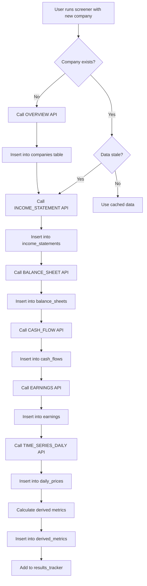
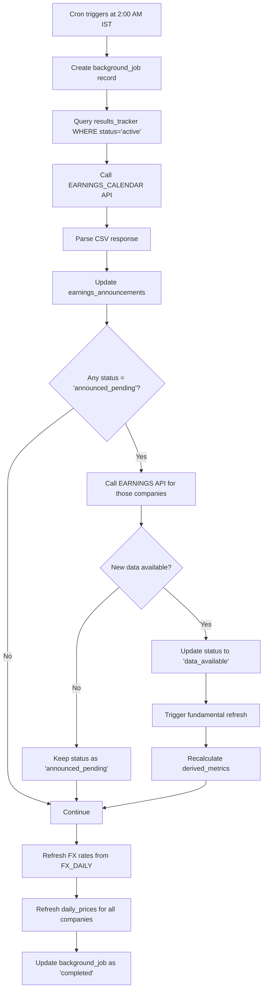
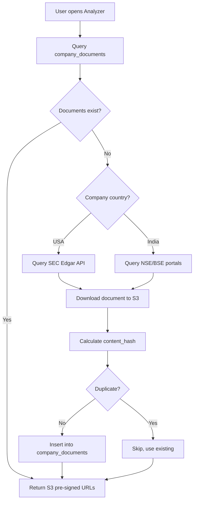

# Investment Research Platform - Database Design Document

**Version**: 1.0  
**Date**: January 16, 2026  
**Status**: Draft for Review  
**Related Documents**: [PRD v1.4](./prd-v1-4.md) | [API Data Mapping](./api-data-mapping.md) | [Design Questions](./design-questions-v1.md)

---

## Table of Contents

1. [Executive Summary](#1-executive-summary)
2. [Design Principles](#2-design-principles)
3. [Technology Stack](#3-technology-stack)
4. [Entity Relationship Diagram](#4-entity-relationship-diagram)
5. [Schema Design](#5-schema-design)
   - 5.1 [Core Data Tables](#51-core-data-tables)
   - 5.2 [Financial Statement Tables](#52-financial-statement-tables)
   - 5.3 [Market Data Tables](#53-market-data-tables)
   - 5.4 [Document Management Tables](#54-document-management-tables)
   - 5.5 [User Activity Tables](#55-user-activity-tables)
   - 5.6 [Derived Metrics Tables](#56-derived-metrics-tables)
   - 5.7 [System Tables](#57-system-tables)
6. [Indexing Strategy](#6-indexing-strategy)
7. [Partitioning Strategy](#7-partitioning-strategy)
8. [Data Flow Diagrams](#8-data-flow-diagrams)
9. [Data Refresh & Staleness Logic](#9-data-refresh--staleness-logic)
10. [Storage Estimates](#10-storage-estimates)
11. [Migration Strategy](#11-migration-strategy)

---

## 1. Executive Summary

This document defines the database schema for the Investment Research Platform, a cloud-hosted web application for systematic equity analysis across US and Indian markets.

### Key Design Decisions

| Decision | Choice | Rationale |
|----------|--------|-----------|
| Database | **PostgreSQL** | JSONB support, full-text search, window functions for analytics |
| Cloud Provider | **AWS** (portable design) | RDS PostgreSQL, S3, mature ecosystem |
| Primary Keys | **UUID** | Distributed-ready, no ticker ambiguity, stable FKs |
| Document Storage | **S3 + DB references** | Cost-effective, scalable, CDN-ready |
| Data Retention | **Forever** | Backtesting lab requires survivorship-bias-free history |
| Multi-tenancy | **user_id FKs added now** | Phase 2 ready without schema migration |
| Computed Metrics | **Hybrid** | Persist quarterly metrics, compute OHLC valuations on-demand |

### Schema Statistics

- **Total Tables**: 18
- **Core Data Tables**: 8 (companies, financials, prices, FX)
- **User Activity Tables**: 7 (screeners, verdicts, tracking)
- **System Tables**: 3 (users, api_cache, jobs)

---

## 2. Design Principles

### 2.1 Immutability of Source Data

All data retrieved from external APIs is stored **as-reported** and never modified after ingestion, except for:
- **Stock splits**: Historical prices adjusted (with audit trail)
- **Financial restatements**: Original + restated values both retained

### 2.2 Separation of Concerns

```
┌─────────────────┐     ┌──────────────────┐     ┌─────────────────┐
│  Foundational   │────▶│  Derived/Computed │────▶│  User Activity  │
│  (API Data)     │     │  (Metrics)        │     │  (Verdicts)     │
└─────────────────┘     └──────────────────┘     └─────────────────┘
     Immutable              Recalculable            User-owned
```

### 2.3 Multi-Tenant Ready

All user-generated data includes `user_id` foreign key, enabling:
- Row Level Security (RLS) for Phase 2
- Per-user data export (GDPR compliance)
- Clean data isolation without schema changes

### 2.4 Audit Trail

Every table includes:
- `created_at TIMESTAMPTZ DEFAULT NOW()`
- `updated_at TIMESTAMPTZ DEFAULT NOW()`
- Version columns where applicable (verdicts, documents)

---

## 3. Technology Stack

### 3.1 Database

| Component | Technology | Notes |
|-----------|------------|-------|
| RDBMS | PostgreSQL 15+ | Managed via AWS RDS |
| Extensions | `uuid-ossp`, `pg_trgm` | UUID generation, trigram search |
| Full-Text Search | Native `tsvector` | Earnings transcripts, company descriptions |
| JSON Storage | JSONB | Screener filters, API response caching |

### 3.2 Storage Architecture

```
┌──────────────────────────────────────────────────────────────┐
│                        AWS Cloud                              │
│  ┌────────────────┐    ┌────────────────┐    ┌─────────────┐ │
│  │  RDS PostgreSQL │    │      S3        │    │  CloudFront │ │
│  │  (Metadata)     │◀──▶│  (Documents)   │◀──▶│  (CDN)      │ │
│  └────────────────┘    └────────────────┘    └─────────────┘ │
│         │                      │                              │
│         ▼                      ▼                              │
│  • Company data          • PDF/PPT files                      │
│  • Financial statements  • Earnings transcripts (large)       │
│  • Daily prices          • Analysis reports                   │
│  • Verdicts/Screeners    • API response cache                 │
└──────────────────────────────────────────────────────────────┘
```

### 3.3 S3 Bucket Structure

```
s3://irp-documents-{env}/
├── company-documents/
│   └── {company_id}/
│       └── {fiscal_period}/
│           └── {document_type}/
│               └── {version_id}_{filename}
├── analysis-reports/
│   └── {user_id}/
│       └── {verdict_id}/
│           └── {filename}
└── api-cache/
    └── {endpoint}/
        └── {symbol}/
            └── {date}.json  (30-day TTL)
```

---

## 4. Entity Relationship Diagram

```mermaid
erDiagram
    users ||--o{ screeners : creates
    users ||--o{ verdicts : records
    users ||--o{ results_tracker : tracks
    
    companies ||--o{ income_statements : has
    companies ||--o{ balance_sheets : has
    companies ||--o{ cash_flows : has
    companies ||--o{ earnings : has
    companies ||--o{ daily_prices : has
    companies ||--o{ shares_outstanding : has
    companies ||--o{ company_documents : has
    companies ||--o{ earnings_transcripts : has
    companies ||--o{ derived_metrics : has
    companies ||--o{ verdicts : receives
    companies ||--o{ results_tracker : tracked_in
    companies ||--o{ earnings_announcements : announces
    
    verdicts ||--o{ verdict_history : versioned_to
    verdicts ||--o{ analysis_reports : supports
    
    fx_rates }o--|| currencies : from
    fx_rates }o--|| currencies : to

    companies {
        uuid company_id PK
        varchar ticker
        varchar exchange
        varchar name
        varchar country
        varchar currency
        varchar sector
        varchar industry
        text description
        varchar fiscal_year_end
        date latest_quarter
        varchar cik
        timestamptz created_at
        timestamptz updated_at
    }
    
    users {
        uuid user_id PK
        varchar username UK
        varchar email UK
        varchar password_hash
        timestamptz created_at
        timestamptz updated_at
    }
    
    income_statements {
        uuid id PK
        uuid company_id FK
        date fiscal_date_ending
        varchar period_type
        varchar reported_currency
        decimal total_revenue
        decimal gross_profit
        decimal operating_income
        decimal net_income
        decimal ebitda
        timestamptz created_at
        timestamptz updated_at
    }
    
    verdicts {
        uuid verdict_id PK
        uuid company_id FK
        uuid user_id FK
        date fiscal_period_analyzed
        boolean growth_acceleration
        boolean ocf_quality
        boolean net_debt_manageable
        varchar future_growth
        varchar valuation_setup
        varchar final_verdict
        text summary_text
        integer version
        timestamptz review_date
        timestamptz created_at
        timestamptz updated_at
    }
    
    screeners {
        uuid screener_id PK
        uuid user_id FK
        varchar title
        text description
        jsonb filter_criteria
        timestamptz created_at
        timestamptz updated_at
    }
```

---

## 5. Schema Design

### 5.1 Core Data Tables

#### 5.1.1 `companies`

Primary company master table. Source: Alpha Vantage `OVERVIEW` endpoint.

```sql
CREATE TABLE companies (
    company_id          UUID PRIMARY KEY DEFAULT gen_random_uuid(),
    ticker              VARCHAR(20) NOT NULL,
    exchange            VARCHAR(20) NOT NULL,
    name                VARCHAR(255) NOT NULL,
    country             VARCHAR(50),
    currency            VARCHAR(10),
    sector              VARCHAR(100),
    industry            VARCHAR(100),
    description         TEXT,
    fiscal_year_end     VARCHAR(20),  -- e.g., "December"
    latest_quarter      DATE,
    cik                 VARCHAR(20),  -- SEC CIK for US companies
    address             TEXT,
    market_cap          BIGINT,       -- Latest snapshot from OVERVIEW
    shares_outstanding  BIGINT,       -- Latest snapshot
    
    -- Search optimization
    search_vector       TSVECTOR GENERATED ALWAYS AS (
                            setweight(to_tsvector('english', coalesce(name, '')), 'A') ||
                            setweight(to_tsvector('english', coalesce(ticker, '')), 'A') ||
                            setweight(to_tsvector('english', coalesce(description, '')), 'B')
                        ) STORED,
    
    -- Audit
    created_at          TIMESTAMPTZ NOT NULL DEFAULT NOW(),
    updated_at          TIMESTAMPTZ NOT NULL DEFAULT NOW(),
    
    -- Constraints
    CONSTRAINT uq_ticker_exchange UNIQUE (ticker, exchange)
);

-- Indexes
CREATE INDEX idx_companies_search ON companies USING GIN (search_vector);
CREATE INDEX idx_companies_country ON companies (country);
CREATE INDEX idx_companies_sector ON companies (sector);
CREATE INDEX idx_companies_market_cap ON companies (market_cap);
```

---

### 5.2 Financial Statement Tables

#### 5.2.1 `income_statements`

Source: Alpha Vantage `INCOME_STATEMENT` endpoint.

```sql
CREATE TABLE income_statements (
    id                      UUID PRIMARY KEY DEFAULT gen_random_uuid(),
    company_id              UUID NOT NULL REFERENCES companies(company_id) ON DELETE CASCADE,
    fiscal_date_ending      DATE NOT NULL,
    period_type             VARCHAR(10) NOT NULL CHECK (period_type IN ('quarterly', 'annual')),
    reported_currency       VARCHAR(10) NOT NULL,
    
    -- Revenue & Profit
    total_revenue           DECIMAL(20, 2),
    total_revenue_status    VARCHAR(20),  -- 'reported' | 'not_disclosed' | 'api_error'
    cost_of_revenue         DECIMAL(20, 2),
    gross_profit            DECIMAL(20, 2),
    gross_profit_status     VARCHAR(20),
    
    -- Operating
    operating_expenses      DECIMAL(20, 2),
    operating_income        DECIMAL(20, 2),
    operating_income_status VARCHAR(20),
    
    -- Below the line
    interest_income         DECIMAL(20, 2),
    interest_expense        DECIMAL(20, 2),
    income_before_tax       DECIMAL(20, 2),
    income_tax_expense      DECIMAL(20, 2),
    net_income              DECIMAL(20, 2),
    net_income_status       VARCHAR(20),
    
    -- Non-cash
    depreciation_amortization DECIMAL(20, 2),
    ebit                    DECIMAL(20, 2),
    ebitda                  DECIMAL(20, 2),
    
    -- Per share
    basic_eps               DECIMAL(10, 4),
    diluted_eps             DECIMAL(10, 4),
    
    -- Audit
    created_at              TIMESTAMPTZ NOT NULL DEFAULT NOW(),
    updated_at              TIMESTAMPTZ NOT NULL DEFAULT NOW(),
    
    -- Constraints
    CONSTRAINT uq_income_company_period UNIQUE (company_id, fiscal_date_ending, period_type)
);

-- Indexes
CREATE INDEX idx_income_company ON income_statements (company_id);
CREATE INDEX idx_income_date ON income_statements (fiscal_date_ending DESC);
CREATE INDEX idx_income_company_date ON income_statements (company_id, fiscal_date_ending DESC);
```

#### 5.2.2 `balance_sheets`

Source: Alpha Vantage `BALANCE_SHEET` endpoint.

```sql
CREATE TABLE balance_sheets (
    id                      UUID PRIMARY KEY DEFAULT gen_random_uuid(),
    company_id              UUID NOT NULL REFERENCES companies(company_id) ON DELETE CASCADE,
    fiscal_date_ending      DATE NOT NULL,
    period_type             VARCHAR(10) NOT NULL CHECK (period_type IN ('quarterly', 'annual')),
    reported_currency       VARCHAR(10) NOT NULL,
    
    -- Assets
    total_assets            DECIMAL(20, 2),
    current_assets          DECIMAL(20, 2),
    cash_and_equivalents    DECIMAL(20, 2),
    short_term_investments  DECIMAL(20, 2),
    inventory               DECIMAL(20, 2),
    accounts_receivable     DECIMAL(20, 2),
    non_current_assets      DECIMAL(20, 2),
    property_plant_equipment DECIMAL(20, 2),
    goodwill                DECIMAL(20, 2),
    intangible_assets       DECIMAL(20, 2),
    
    -- Liabilities
    total_liabilities       DECIMAL(20, 2),
    current_liabilities     DECIMAL(20, 2),
    accounts_payable        DECIMAL(20, 2),
    short_term_debt         DECIMAL(20, 2),
    short_term_debt_status  VARCHAR(20),
    non_current_liabilities DECIMAL(20, 2),
    long_term_debt          DECIMAL(20, 2),
    long_term_debt_status   VARCHAR(20),
    
    -- Equity
    total_shareholder_equity DECIMAL(20, 2),
    retained_earnings       DECIMAL(20, 2),
    common_stock            DECIMAL(20, 2),
    common_stock_shares_outstanding BIGINT,
    
    -- Audit
    created_at              TIMESTAMPTZ NOT NULL DEFAULT NOW(),
    updated_at              TIMESTAMPTZ NOT NULL DEFAULT NOW(),
    
    -- Constraints
    CONSTRAINT uq_balance_company_period UNIQUE (company_id, fiscal_date_ending, period_type)
);

-- Indexes
CREATE INDEX idx_balance_company ON balance_sheets (company_id);
CREATE INDEX idx_balance_company_date ON balance_sheets (company_id, fiscal_date_ending DESC);
```

#### 5.2.3 `cash_flows`

Source: Alpha Vantage `CASH_FLOW` endpoint.

```sql
CREATE TABLE cash_flows (
    id                      UUID PRIMARY KEY DEFAULT gen_random_uuid(),
    company_id              UUID NOT NULL REFERENCES companies(company_id) ON DELETE CASCADE,
    fiscal_date_ending      DATE NOT NULL,
    period_type             VARCHAR(10) NOT NULL CHECK (period_type IN ('quarterly', 'annual')),
    reported_currency       VARCHAR(10) NOT NULL,
    
    -- Operating Activities
    operating_cashflow      DECIMAL(20, 2),
    operating_cashflow_status VARCHAR(20),
    net_income              DECIMAL(20, 2),
    depreciation_depletion  DECIMAL(20, 2),
    change_in_receivables   DECIMAL(20, 2),
    change_in_inventory     DECIMAL(20, 2),
    change_in_payables      DECIMAL(20, 2),
    
    -- Investing Activities
    capital_expenditures    DECIMAL(20, 2),
    capital_expenditures_status VARCHAR(20),
    investments             DECIMAL(20, 2),
    
    -- Financing Activities
    dividend_payout         DECIMAL(20, 2),
    stock_repurchase        DECIMAL(20, 2),
    debt_repayment          DECIMAL(20, 2),
    
    -- Net Change
    change_in_cash          DECIMAL(20, 2),
    
    -- Audit
    created_at              TIMESTAMPTZ NOT NULL DEFAULT NOW(),
    updated_at              TIMESTAMPTZ NOT NULL DEFAULT NOW(),
    
    -- Constraints
    CONSTRAINT uq_cashflow_company_period UNIQUE (company_id, fiscal_date_ending, period_type)
);

-- Indexes
CREATE INDEX idx_cashflow_company ON cash_flows (company_id);
CREATE INDEX idx_cashflow_company_date ON cash_flows (company_id, fiscal_date_ending DESC);
```

#### 5.2.4 `earnings`

Source: Alpha Vantage `EARNINGS` endpoint.

```sql
CREATE TABLE earnings (
    id                      UUID PRIMARY KEY DEFAULT gen_random_uuid(),
    company_id              UUID NOT NULL REFERENCES companies(company_id) ON DELETE CASCADE,
    fiscal_date_ending      DATE NOT NULL,
    period_type             VARCHAR(10) NOT NULL CHECK (period_type IN ('quarterly', 'annual')),
    
    -- Earnings data
    reported_date           DATE,
    reported_eps            DECIMAL(10, 4),
    estimated_eps           DECIMAL(10, 4),
    surprise                DECIMAL(10, 4),
    surprise_percentage     DECIMAL(10, 4),
    report_time             VARCHAR(20),  -- 'pre-market' | 'post-market' | 'during-market'
    
    -- Audit
    created_at              TIMESTAMPTZ NOT NULL DEFAULT NOW(),
    updated_at              TIMESTAMPTZ NOT NULL DEFAULT NOW(),
    
    -- Constraints
    CONSTRAINT uq_earnings_company_period UNIQUE (company_id, fiscal_date_ending, period_type)
);

-- Indexes
CREATE INDEX idx_earnings_company ON earnings (company_id);
CREATE INDEX idx_earnings_reported_date ON earnings (reported_date DESC);
CREATE INDEX idx_earnings_company_date ON earnings (company_id, fiscal_date_ending DESC);
```

---

### 5.3 Market Data Tables

#### 5.3.1 `daily_prices`

Source: Alpha Vantage `TIME_SERIES_DAILY_ADJUSTED` endpoint.

> [!IMPORTANT]
> This table will grow large (~1.9M+ rows/year for 1500 companies).
> Partitioned by year for query performance. See [Section 7](#7-partitioning-strategy).

```sql
CREATE TABLE daily_prices (
    id                  UUID PRIMARY KEY DEFAULT gen_random_uuid(),
    company_id          UUID NOT NULL REFERENCES companies(company_id) ON DELETE CASCADE,
    price_date          DATE NOT NULL,
    
    -- OHLC
    open_price          DECIMAL(15, 4),
    high_price          DECIMAL(15, 4),
    low_price           DECIMAL(15, 4),
    close_price         DECIMAL(15, 4),
    adjusted_close      DECIMAL(15, 4),
    
    -- Volume & Corporate Actions
    volume              BIGINT,
    dividend_amount     DECIMAL(15, 4),
    split_coefficient   DECIMAL(10, 4),
    
    -- Audit
    created_at          TIMESTAMPTZ NOT NULL DEFAULT NOW(),
    
    -- Constraints
    CONSTRAINT uq_price_company_date UNIQUE (company_id, price_date)
) PARTITION BY RANGE (price_date);

-- Create partitions for each year
CREATE TABLE daily_prices_2020 PARTITION OF daily_prices
    FOR VALUES FROM ('2020-01-01') TO ('2021-01-01');
CREATE TABLE daily_prices_2021 PARTITION OF daily_prices
    FOR VALUES FROM ('2021-01-01') TO ('2022-01-01');
CREATE TABLE daily_prices_2022 PARTITION OF daily_prices
    FOR VALUES FROM ('2022-01-01') TO ('2023-01-01');
CREATE TABLE daily_prices_2023 PARTITION OF daily_prices
    FOR VALUES FROM ('2023-01-01') TO ('2024-01-01');
CREATE TABLE daily_prices_2024 PARTITION OF daily_prices
    FOR VALUES FROM ('2024-01-01') TO ('2025-01-01');
CREATE TABLE daily_prices_2025 PARTITION OF daily_prices
    FOR VALUES FROM ('2025-01-01') TO ('2026-01-01');
CREATE TABLE daily_prices_2026 PARTITION OF daily_prices
    FOR VALUES FROM ('2026-01-01') TO ('2027-01-01');
CREATE TABLE daily_prices_future PARTITION OF daily_prices
    FOR VALUES FROM ('2027-01-01') TO (MAXVALUE);

-- Indexes (applied to all partitions)
CREATE INDEX idx_prices_company_date ON daily_prices (company_id, price_date DESC);
```

#### 5.3.2 `shares_outstanding`

Source: Alpha Vantage `SHARES_OUTSTANDING` endpoint.

```sql
CREATE TABLE shares_outstanding (
    id                  UUID PRIMARY KEY DEFAULT gen_random_uuid(),
    company_id          UUID NOT NULL REFERENCES companies(company_id) ON DELETE CASCADE,
    record_date         DATE NOT NULL,
    shares_outstanding  BIGINT NOT NULL,
    
    -- Audit
    created_at          TIMESTAMPTZ NOT NULL DEFAULT NOW(),
    
    -- Constraints  
    CONSTRAINT uq_shares_company_date UNIQUE (company_id, record_date)
);

-- Indexes
CREATE INDEX idx_shares_company_date ON shares_outstanding (company_id, record_date DESC);
```

#### 5.3.3 `fx_rates`

Source: Alpha Vantage `FX_DAILY` endpoint.

```sql
CREATE TABLE fx_rates (
    id              UUID PRIMARY KEY DEFAULT gen_random_uuid(),
    from_currency   VARCHAR(10) NOT NULL,
    to_currency     VARCHAR(10) NOT NULL,
    rate_date       DATE NOT NULL,
    
    -- OHLC for FX
    open_rate       DECIMAL(15, 6),
    high_rate       DECIMAL(15, 6),
    low_rate        DECIMAL(15, 6),
    close_rate      DECIMAL(15, 6),
    
    -- Audit
    created_at      TIMESTAMPTZ NOT NULL DEFAULT NOW(),
    
    -- Constraints
    CONSTRAINT uq_fx_pair_date UNIQUE (from_currency, to_currency, rate_date)
);

-- Indexes
CREATE INDEX idx_fx_pair_date ON fx_rates (from_currency, to_currency, rate_date DESC);
```

---

### 5.4 Document Management Tables

#### 5.4.1 `company_documents`

Metadata for documents stored in S3.

```sql
CREATE TABLE company_documents (
    document_id         UUID PRIMARY KEY DEFAULT gen_random_uuid(),
    company_id          UUID NOT NULL REFERENCES companies(company_id) ON DELETE CASCADE,
    
    -- Period & Type
    fiscal_period       DATE NOT NULL,  -- Period ending date (e.g., 2025-03-31)
    document_type       VARCHAR(50) NOT NULL CHECK (document_type IN (
                            'investor_presentation',
                            'earnings_call_transcript',
                            'earnings_release',
                            'quarterly_report_10q',
                            'annual_report_10k',
                            'form_8k',
                            'proxy_statement',
                            'other'
                        )),
    
    -- File metadata
    filename            VARCHAR(255) NOT NULL,
    file_format         VARCHAR(10) NOT NULL CHECK (file_format IN ('pdf', 'ppt', 'pptx', 'doc', 'docx', 'txt', 'md')),
    file_size_bytes     BIGINT,
    s3_key              VARCHAR(500) NOT NULL,  -- S3 object key
    s3_version_id       VARCHAR(100),           -- S3 version if versioning enabled
    
    -- Source tracking
    source              VARCHAR(50) NOT NULL CHECK (source IN (
                            'sec_edgar',
                            'nse_india',
                            'bse_india',
                            'company_ir_website',
                            'alpha_vantage',
                            'quartr',
                            'manual_upload'
                        )),
    source_url          TEXT,  -- Original URL if scraped
    
    -- Deduplication
    content_hash        VARCHAR(64),  -- SHA256 hash of file content
    
    -- Audit
    retrieval_date      TIMESTAMPTZ NOT NULL DEFAULT NOW(),
    created_at          TIMESTAMPTZ NOT NULL DEFAULT NOW(),
    
    -- Prevent duplicate files
    CONSTRAINT uq_document_hash UNIQUE (company_id, content_hash)
);

-- Indexes
CREATE INDEX idx_docs_company ON company_documents (company_id);
CREATE INDEX idx_docs_company_period ON company_documents (company_id, fiscal_period DESC);
CREATE INDEX idx_docs_type ON company_documents (document_type);
```

#### 5.4.2 `earnings_transcripts`

Separate table for searchable transcript text (not in S3).

```sql
CREATE TABLE earnings_transcripts (
    transcript_id       UUID PRIMARY KEY DEFAULT gen_random_uuid(),
    company_id          UUID NOT NULL REFERENCES companies(company_id) ON DELETE CASCADE,
    fiscal_period       DATE NOT NULL,
    
    -- Transcript content
    transcript_text     TEXT NOT NULL,
    
    -- Full-text search
    search_vector       TSVECTOR GENERATED ALWAYS AS (
                            to_tsvector('english', transcript_text)
                        ) STORED,
    
    -- Metadata
    source              VARCHAR(50) NOT NULL DEFAULT 'alpha_vantage',
    word_count          INTEGER,
    
    -- Audit
    created_at          TIMESTAMPTZ NOT NULL DEFAULT NOW(),
    updated_at          TIMESTAMPTZ NOT NULL DEFAULT NOW(),
    
    -- Constraints
    CONSTRAINT uq_transcript_company_period UNIQUE (company_id, fiscal_period)
);

-- Indexes
CREATE INDEX idx_transcript_search ON earnings_transcripts USING GIN (search_vector);
CREATE INDEX idx_transcript_company ON earnings_transcripts (company_id);
```

---

### 5.5 User Activity Tables

#### 5.5.1 `users`

```sql
CREATE TABLE users (
    user_id             UUID PRIMARY KEY DEFAULT gen_random_uuid(),
    username            VARCHAR(50) NOT NULL UNIQUE,
    email               VARCHAR(255) NOT NULL UNIQUE,
    password_hash       VARCHAR(255) NOT NULL,  -- bcrypt hash
    
    -- Profile
    display_name        VARCHAR(100),
    timezone            VARCHAR(50) DEFAULT 'Asia/Kolkata',
    
    -- Status
    is_active           BOOLEAN NOT NULL DEFAULT TRUE,
    
    -- Audit
    created_at          TIMESTAMPTZ NOT NULL DEFAULT NOW(),
    updated_at          TIMESTAMPTZ NOT NULL DEFAULT NOW(),
    last_login_at       TIMESTAMPTZ
);
```

#### 5.5.2 `screeners`

```sql
CREATE TABLE screeners (
    screener_id         UUID PRIMARY KEY DEFAULT gen_random_uuid(),
    user_id             UUID NOT NULL REFERENCES users(user_id) ON DELETE CASCADE,
    
    -- Definition
    title               VARCHAR(100) NOT NULL,
    description         TEXT,
    filter_criteria     JSONB NOT NULL,  -- Structured filter definition
    
    -- Ordering
    display_order       INTEGER,
    
    -- Audit
    created_at          TIMESTAMPTZ NOT NULL DEFAULT NOW(),
    updated_at          TIMESTAMPTZ NOT NULL DEFAULT NOW()
);

-- Indexes
CREATE INDEX idx_screeners_user ON screeners (user_id);
CREATE INDEX idx_screeners_filters ON screeners USING GIN (filter_criteria);
```

**Filter Criteria JSONB Schema Example**:
```json
{
  "exchanges": ["NYSE", "NASDAQ", "NSE"],
  "countries": ["USA", "India"],
  "market_cap": {
    "min": 50000000,
    "max": 10000000000,
    "currency": "USD"
  },
  "sectors": ["Technology", "Healthcare"],
  "momentum": {
    "period": "monthly",
    "min_change_percent": 5.0
  }
}
```

#### 5.5.3 `verdicts`

```sql
CREATE TABLE verdicts (
    verdict_id                  UUID PRIMARY KEY DEFAULT gen_random_uuid(),
    company_id                  UUID NOT NULL REFERENCES companies(company_id) ON DELETE CASCADE,
    user_id                     UUID NOT NULL REFERENCES users(user_id) ON DELETE CASCADE,
    
    -- Period analyzed
    fiscal_period_analyzed      DATE NOT NULL,  -- Which quarter's results this verdict covers
    
    -- Assessment parameters (nullable for partial saves)
    growth_acceleration         BOOLEAN,        -- Yes/No
    ocf_quality                 BOOLEAN,        -- Yes/No
    net_debt_manageable         BOOLEAN,        -- Yes/No
    future_growth               VARCHAR(20) CHECK (future_growth IN (
                                    'strong_acceleration', 'slight_acceleration', 
                                    'flat', 'downward', 'unclear'
                                )),
    valuation_setup             VARCHAR(20) CHECK (valuation_setup IN (
                                    'attractive', 'fair', 'expensive', 'unclear'
                                )),
    final_verdict               VARCHAR(20) CHECK (final_verdict IN (
                                    'invest', 'pass', 'watchlist'
                                )),
    
    -- Free-text summary
    summary_text                TEXT,
    
    -- Version control
    version                     INTEGER NOT NULL DEFAULT 1,
    
    -- Optimistic locking
    lock_version                INTEGER NOT NULL DEFAULT 0,
    
    -- Audit
    review_date                 TIMESTAMPTZ NOT NULL DEFAULT NOW(),
    created_at                  TIMESTAMPTZ NOT NULL DEFAULT NOW(),
    updated_at                  TIMESTAMPTZ NOT NULL DEFAULT NOW(),
    
    -- Constraints
    CONSTRAINT uq_verdict_company_period UNIQUE (company_id, user_id, fiscal_period_analyzed)
);

-- Indexes
CREATE INDEX idx_verdicts_user ON verdicts (user_id);
CREATE INDEX idx_verdicts_company ON verdicts (company_id);
CREATE INDEX idx_verdicts_final ON verdicts (final_verdict);
CREATE INDEX idx_verdicts_review_date ON verdicts (review_date DESC);
```

#### 5.5.4 `verdict_history`

Full snapshot of each verdict version.

```sql
CREATE TABLE verdict_history (
    history_id                  UUID PRIMARY KEY DEFAULT gen_random_uuid(),
    verdict_id                  UUID NOT NULL REFERENCES verdicts(verdict_id) ON DELETE CASCADE,
    version                     INTEGER NOT NULL,
    
    -- Full snapshot of all fields at this version
    growth_acceleration         BOOLEAN,
    ocf_quality                 BOOLEAN,
    net_debt_manageable         BOOLEAN,
    future_growth               VARCHAR(20),
    valuation_setup             VARCHAR(20),
    final_verdict               VARCHAR(20),
    summary_text                TEXT,
    
    -- Who and when
    user_id                     UUID NOT NULL REFERENCES users(user_id),
    recorded_at                 TIMESTAMPTZ NOT NULL DEFAULT NOW(),
    
    -- Constraints
    CONSTRAINT uq_verdict_version UNIQUE (verdict_id, version)
);

-- Indexes
CREATE INDEX idx_verdict_history_verdict ON verdict_history (verdict_id);
CREATE INDEX idx_verdict_history_recorded ON verdict_history (recorded_at DESC);
```

#### 5.5.5 `analysis_reports`

User-uploaded analysis documents (Perplexity output, notes, etc.).

```sql
CREATE TABLE analysis_reports (
    report_id           UUID PRIMARY KEY DEFAULT gen_random_uuid(),
    verdict_id          UUID NOT NULL REFERENCES verdicts(verdict_id) ON DELETE CASCADE,
    
    -- File metadata
    filename            VARCHAR(255) NOT NULL,
    file_format         VARCHAR(10) NOT NULL CHECK (file_format IN ('pdf', 'docx', 'txt', 'md')),
    file_size_bytes     BIGINT,
    s3_key              VARCHAR(500) NOT NULL,
    
    -- Audit
    uploaded_at         TIMESTAMPTZ NOT NULL DEFAULT NOW()
);

-- Indexes
CREATE INDEX idx_analysis_reports_verdict ON analysis_reports (verdict_id);
```

#### 5.5.6 `results_tracker`

Tracks companies in user's earnings monitoring universe.

```sql
CREATE TABLE results_tracker (
    tracker_id              UUID PRIMARY KEY DEFAULT gen_random_uuid(),
    company_id              UUID NOT NULL REFERENCES companies(company_id) ON DELETE CASCADE,
    user_id                 UUID NOT NULL REFERENCES users(user_id) ON DELETE CASCADE,
    
    -- Lifecycle
    lifecycle_status        VARCHAR(20) NOT NULL DEFAULT 'active' CHECK (lifecycle_status IN ('active', 'archived')),
    
    -- Tracking metadata
    first_tracked_at        TIMESTAMPTZ NOT NULL DEFAULT NOW(),
    last_screener_appearance TIMESTAMPTZ,
    archived_at             TIMESTAMPTZ,
    archived_reason         VARCHAR(50),  -- 'manual' | 'auto_12_months'
    
    -- Audit
    created_at              TIMESTAMPTZ NOT NULL DEFAULT NOW(),
    updated_at              TIMESTAMPTZ NOT NULL DEFAULT NOW(),
    
    -- Constraints
    CONSTRAINT uq_tracker_company_user UNIQUE (company_id, user_id)
);

-- Indexes
CREATE INDEX idx_tracker_user ON results_tracker (user_id);
CREATE INDEX idx_tracker_status ON results_tracker (lifecycle_status);
CREATE INDEX idx_tracker_user_status ON results_tracker (user_id, lifecycle_status);
```

#### 5.5.7 `earnings_announcements`

Tracks upcoming and historical earnings dates.

```sql
CREATE TABLE earnings_announcements (
    announcement_id     UUID PRIMARY KEY DEFAULT gen_random_uuid(),
    company_id          UUID NOT NULL REFERENCES companies(company_id) ON DELETE CASCADE,
    
    -- Announcement details
    report_date         DATE NOT NULL,  -- Announced/expected earnings date
    fiscal_date_ending  DATE NOT NULL,  -- Which fiscal period
    
    -- Status
    status              VARCHAR(30) NOT NULL DEFAULT 'upcoming' CHECK (status IN (
                            'upcoming',           -- Future date
                            'announced_pending',  -- Date passed, data not yet in API
                            'data_available'      -- Data available in EARNINGS endpoint
                        )),
    
    -- Estimates
    estimate_eps        DECIMAL(10, 4),
    estimate_currency   VARCHAR(10),
    
    -- Source
    source              VARCHAR(50),
    
    -- Polling metadata
    last_polled_at      TIMESTAMPTZ,
    
    -- Audit
    created_at          TIMESTAMPTZ NOT NULL DEFAULT NOW(),
    updated_at          TIMESTAMPTZ NOT NULL DEFAULT NOW(),
    
    -- Constraints
    CONSTRAINT uq_announcement_company_period UNIQUE (company_id, fiscal_date_ending)
);

-- Indexes
CREATE INDEX idx_announcements_date ON earnings_announcements (report_date);
CREATE INDEX idx_announcements_status ON earnings_announcements (status);
CREATE INDEX idx_announcements_company ON earnings_announcements (company_id);
```

---

### 5.6 Derived Metrics Tables

#### 5.6.1 `derived_metrics`

Pre-computed metrics for screener performance.

```sql
CREATE TABLE derived_metrics (
    id                      UUID PRIMARY KEY DEFAULT gen_random_uuid(),
    company_id              UUID NOT NULL REFERENCES companies(company_id) ON DELETE CASCADE,
    fiscal_date_ending      DATE NOT NULL,
    period_type             VARCHAR(10) NOT NULL CHECK (period_type IN ('quarterly', 'annual')),
    
    -- Margin metrics
    gross_margin_pct        DECIMAL(10, 4),
    operating_margin_pct    DECIMAL(10, 4),
    net_margin_pct          DECIMAL(10, 4),
    pbt_margin_pct          DECIMAL(10, 4),
    
    -- Growth metrics
    yoy_revenue_growth_pct  DECIMAL(10, 4),
    yoy_growth_acceleration_delta DECIMAL(10, 4),  -- pp change
    yoy_growth_acceleration_ratio DECIMAL(10, 4),  -- % change
    op_margin_expansion_pct DECIMAL(10, 4),
    
    -- Cash flow metrics
    free_cash_flow          DECIMAL(20, 2),
    ocf_pct_revenue         DECIMAL(10, 4),
    fcf_pct_revenue         DECIMAL(10, 4),
    
    -- Balance sheet derived
    total_debt              DECIMAL(20, 2),
    net_debt                DECIMAL(20, 2),
    revenue_minus_net_debt_pct DECIMAL(10, 4),
    
    -- Calculation metadata
    calculation_date        TIMESTAMPTZ NOT NULL DEFAULT NOW(),
    
    -- Audit
    created_at              TIMESTAMPTZ NOT NULL DEFAULT NOW(),
    updated_at              TIMESTAMPTZ NOT NULL DEFAULT NOW(),
    
    -- Constraints
    CONSTRAINT uq_derived_company_period UNIQUE (company_id, fiscal_date_ending, period_type)
);

-- Indexes
CREATE INDEX idx_derived_company ON derived_metrics (company_id);
CREATE INDEX idx_derived_company_date ON derived_metrics (company_id, fiscal_date_ending DESC);
CREATE INDEX idx_derived_growth ON derived_metrics (yoy_revenue_growth_pct);
CREATE INDEX idx_derived_acceleration ON derived_metrics (yoy_growth_acceleration_delta);
```

---

### 5.7 System Tables

#### 5.7.1 `api_response_cache`

Temporary cache for debugging API responses (30-day TTL via S3 lifecycle).

```sql
CREATE TABLE api_response_cache (
    cache_id            UUID PRIMARY KEY DEFAULT gen_random_uuid(),
    endpoint            VARCHAR(100) NOT NULL,
    symbol              VARCHAR(20) NOT NULL,
    request_params      JSONB,
    s3_key              VARCHAR(500) NOT NULL,
    
    -- Response metadata
    http_status_code    INTEGER,
    response_size_bytes BIGINT,
    
    -- TTL
    expires_at          TIMESTAMPTZ NOT NULL,
    
    -- Audit
    created_at          TIMESTAMPTZ NOT NULL DEFAULT NOW()
);

-- Index for lookup
CREATE INDEX idx_cache_endpoint_symbol ON api_response_cache (endpoint, symbol);
CREATE INDEX idx_cache_expires ON api_response_cache (expires_at);
```

#### 5.7.2 `background_jobs`

Tracks nightly polling and refresh jobs.

```sql
CREATE TABLE background_jobs (
    job_id              UUID PRIMARY KEY DEFAULT gen_random_uuid(),
    job_type            VARCHAR(50) NOT NULL CHECK (job_type IN (
                            'earnings_calendar_poll',
                            'document_refresh',
                            'price_refresh',
                            'fx_refresh',
                            'fundamental_refresh',
                            'derived_metrics_recalc'
                        )),
    
    -- Job details
    scheduled_at        TIMESTAMPTZ NOT NULL,
    started_at          TIMESTAMPTZ,
    completed_at        TIMESTAMPTZ,
    
    -- Status
    status              VARCHAR(20) NOT NULL DEFAULT 'pending' CHECK (status IN (
                            'pending', 'running', 'completed', 'failed', 'cancelled'
                        )),
    
    -- Results
    companies_processed INTEGER,
    records_updated     INTEGER,
    error_message       TEXT,
    error_details       JSONB,
    
    -- Audit
    created_at          TIMESTAMPTZ NOT NULL DEFAULT NOW()
);

-- Indexes
CREATE INDEX idx_jobs_type_status ON background_jobs (job_type, status);
CREATE INDEX idx_jobs_scheduled ON background_jobs (scheduled_at DESC);
```

#### 5.7.3 `refresh_tokens`

JWT refresh token storage for authentication.

```sql
CREATE TABLE refresh_tokens (
    token_id            UUID PRIMARY KEY DEFAULT gen_random_uuid(),
    user_id             UUID NOT NULL REFERENCES users(user_id) ON DELETE CASCADE,
    token_hash          VARCHAR(255) NOT NULL,  -- SHA256 hash of token
    
    -- Token metadata
    issued_at           TIMESTAMPTZ NOT NULL DEFAULT NOW(),
    expires_at          TIMESTAMPTZ NOT NULL,
    revoked_at          TIMESTAMPTZ,
    
    -- Device tracking
    device_info         JSONB,
    ip_address          INET,
    
    -- Constraints
    CONSTRAINT uq_token_hash UNIQUE (token_hash)
);

-- Indexes
CREATE INDEX idx_tokens_user ON refresh_tokens (user_id);
CREATE INDEX idx_tokens_expires ON refresh_tokens (expires_at);
```

---

## 6. Indexing Strategy

### 6.1 Index Summary by Table

| Table | Index Type | Columns | Purpose |
|-------|-----------|---------|---------|
| `companies` | GIN | `search_vector` | Full-text search |
| `companies` | B-tree | `country`, `sector`, `market_cap` | Screener filters |
| `income_statements` | B-tree | `(company_id, fiscal_date_ending DESC)` | Time-series queries |
| `daily_prices` | B-tree (partitioned) | `(company_id, price_date DESC)` | Price history |
| `verdicts` | B-tree | `user_id`, `company_id`, `final_verdict` | User queries |
| `earnings_transcripts` | GIN | `search_vector` | Transcript search |
| `screeners` | GIN | `filter_criteria` | JSONB contains queries |

### 6.2 Index Maintenance

```sql
-- Recommended: Run weekly during low-traffic window
REINDEX DATABASE investment_research CONCURRENTLY;

-- Monitor index bloat
SELECT
    schemaname || '.' || relname AS table_name,
    pg_size_pretty(pg_relation_size(indexrelid)) AS index_size,
    idx_scan AS index_scans
FROM pg_stat_user_indexes
ORDER BY pg_relation_size(indexrelid) DESC
LIMIT 20;
```

---

## 7. Partitioning Strategy

### 7.1 Partitioned Tables

| Table | Partition Key | Partition Scheme | Retention |
|-------|--------------|------------------|-----------|
| `daily_prices` | `price_date` | Yearly ranges | Forever |
| `api_response_cache` | `created_at` | Monthly (optional) | 30 days (S3 lifecycle) |

### 7.2 Partition Management

```sql
-- Create next year's partition (run annually in December)
CREATE TABLE daily_prices_2027 PARTITION OF daily_prices
    FOR VALUES FROM ('2027-01-01') TO ('2028-01-01');

-- Move "future" partition ceiling
ALTER TABLE daily_prices DETACH PARTITION daily_prices_future;
DROP TABLE daily_prices_future;
CREATE TABLE daily_prices_future PARTITION OF daily_prices
    FOR VALUES FROM ('2028-01-01') TO (MAXVALUE);
```

### 7.3 Query Performance

Partition pruning ensures queries only scan relevant partitions:

```sql
-- This query only scans 2025-2026 partitions
EXPLAIN SELECT * FROM daily_prices
WHERE company_id = 'xxx' AND price_date >= '2025-01-01';
```

---

## 8. Data Flow Diagrams

### 8.1 Initial Company Ingestion



### 8.2 Nightly Polling Job (2:00 AM IST)



### 8.3 Document Retrieval Flow



---

## 9. Data Refresh & Staleness Logic

### 9.1 Staleness Thresholds

| Data Type | Staleness Threshold | Refresh Trigger |
|-----------|---------------------|-----------------|
| Market Cap | > 1 trading day | Next screener run |
| Daily Prices | > 1 trading day | Nightly job |
| Fundamentals | New quarter announced | Nightly job detection |
| FX Rates | > 1 day | Nightly job |
| Earnings Dates | Always fresh | Nightly job |
| Documents | New quarter announced | Nightly job |

### 9.2 Staleness Check Query

```sql
-- Check if company data needs refresh
SELECT 
    c.company_id,
    c.ticker,
    c.latest_quarter,
    ea.status AS announcement_status,
    MAX(dp.price_date) AS last_price_date,
    CASE 
        WHEN MAX(dp.price_date) < CURRENT_DATE - INTERVAL '1 day' THEN 'price_stale'
        WHEN ea.status = 'data_available' AND 
             c.latest_quarter < ea.fiscal_date_ending THEN 'fundamental_stale'
        ELSE 'fresh'
    END AS staleness_status
FROM companies c
LEFT JOIN daily_prices dp ON c.company_id = dp.company_id
LEFT JOIN earnings_announcements ea ON c.company_id = ea.company_id
WHERE c.company_id = :company_id
GROUP BY c.company_id, c.ticker, c.latest_quarter, ea.status, ea.fiscal_date_ending;
```

---

## 10. Storage Estimates

### 10.1 Row Count Projections (Year 1)

| Table | Rows/Company | Companies | Total Rows | Row Size | Total Size |
|-------|--------------|-----------|------------|----------|------------|
| `companies` | 1 | 1,500 | 1,500 | 2 KB | 3 MB |
| `income_statements` | 40 (10 yr × 4 qtrs) | 1,500 | 60,000 | 500 B | 30 MB |
| `balance_sheets` | 40 | 1,500 | 60,000 | 600 B | 36 MB |
| `cash_flows` | 40 | 1,500 | 60,000 | 400 B | 24 MB |
| `daily_prices` | 1,260 (5 yr × 252 days) | 1,500 | 1,890,000 | 100 B | 189 MB |
| `earnings_transcripts` | 10 | 1,500 | 15,000 | 50 KB | 750 MB |
| `derived_metrics` | 40 | 1,500 | 60,000 | 200 B | 12 MB |

**Total Database Size (Year 1)**: ~1.1 GB (excluding indexes)

### 10.2 S3 Storage Projections

| Document Type | Avg Size | Count/Company | Total |
|---------------|----------|---------------|-------|
| Investor Presentations | 5 MB | 10 | 75 GB |
| 10-K/Annual Reports | 10 MB | 5 | 75 GB |
| 10-Q/Quarterly Reports | 2 MB | 20 | 60 GB |
| Other Documents | 1 MB | 10 | 15 GB |

**Total S3 Size (Year 1)**: ~225 GB

### 10.3 Cost Estimates (AWS)

| Service | Specification | Monthly Cost |
|---------|--------------|--------------|
| RDS PostgreSQL | db.t3.medium (2 vCPU, 4GB) | ~$50 |
| RDS Storage | 100 GB SSD | ~$12 |
| S3 Standard-IA | 250 GB | ~$3 |
| S3 Requests | ~100K/month | ~$0.50 |
| **Total** | | **~$66/month** |

---

## 11. Migration Strategy

### 11.1 Schema Versioning

Database schema version tracked in dedicated table:

```sql
CREATE TABLE schema_migrations (
    version         INTEGER PRIMARY KEY,
    name            VARCHAR(255) NOT NULL,
    applied_at      TIMESTAMPTZ NOT NULL DEFAULT NOW(),
    execution_time_ms INTEGER,
    checksum        VARCHAR(64)
);
```

### 11.2 Language-Agnostic Approach

Schema provided as pure SQL DDL files:

```
migrations/
├── 001_initial_schema.sql
├── 002_add_search_vectors.sql
├── 003_add_partitioning.sql
└── ...
```

Compatible with any backend migration tool:
- **Rust**: `sqlx migrate`, `refinery`, `diesel`
- **Python**: `alembic`, Django migrations
- **Node.js**: `prisma migrate`, `knex`

### 11.3 Phase 1 → Phase 2 Evolution

No schema changes required for multi-user:
1. `user_id` FKs already present
2. Enable PostgreSQL Row Level Security:

```sql
ALTER TABLE screeners ENABLE ROW LEVEL SECURITY;
CREATE POLICY screeners_user_isolation ON screeners
    USING (user_id = current_setting('app.current_user_id')::UUID);
```

---

## Appendix A: Complete DDL Script

See separate file: [`migrations/001_initial_schema.sql`](./migrations/001_initial_schema.sql)

---

## Appendix B: Glossary

| Term | Definition |
|------|------------|
| **Fiscal Period** | End date of financial reporting period (e.g., 2025-03-31) |
| **Foundational Data** | Data retrieved directly from APIs, stored immutably |
| **Derived Metrics** | Calculated values from foundational data |
| **TTL** | Time-to-Live (expiration period for cached data) |
| **RLS** | Row Level Security (PostgreSQL feature for data isolation) |

---

**End of Database Design Document v1.0**

---

**Next Steps**:
1. Review and approve this design
2. Generate complete SQL DDL migration script
3. Set up AWS RDS PostgreSQL instance
4. Implement database access layer in chosen backend language
